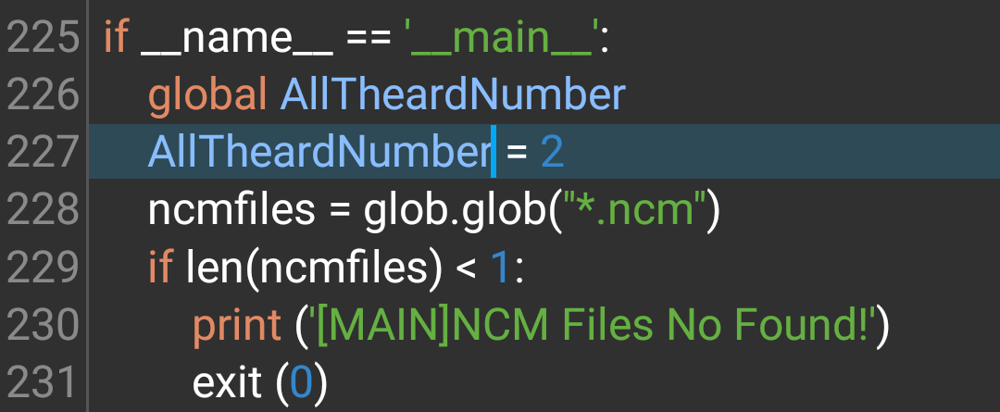

<h1>Netease Cloud Music Copyright Protection File Dump (Python version)</h1>

<h2>简介</h2>

Python版本解密ncm文件，根据贴吧某位大神的源码再开发而来，加了很多使用功能，比如嵌入歌曲tags和封面图片，下载歌词啥的。

<p5>投稿了使用教程在B站上的: <p5>
https://www.bilibili.com/video/av59847987/
<p6>flac文件和mp3文件正常内嵌图片和写入歌曲信息</p6>
一个在Win10上编译好的版本(使用源码和编译时间: 2019.7.19--16:30) : https://www.lanzous.com/i528che
<h2>安装</h2>
<h3 style="background-color:green">依赖 pycrypto库</h3>

<code>pip(3) install pycrypto</code>

推荐使用下面的库！不安装上面的库

<code>pip3 install -i https://pypi.douban.com/simple pycryptodome</code>
，嫌弃官方源太慢可以自行百度国内pypi源然后更换
使用<code>pip install pycryptodome mutagen requests urllib3</code>来安装依赖库

<h3>使用方法：</h3>

直接将Ncm2Music.py复制到有.ncm文件的文件夹里运行即可。

您可以将NCM文件任意更名，就算更名也能输出正常的音乐文件歌手和歌曲名，因为这些数据被保存在ncm文件内了

<u>推荐在转换前将ncm文件全部更名为1.ncm,2.ncm,3.ncm.....这样可以防止因文件名内含有特殊字符导致的转换出错!这样改名并没有害处!</u>

<h5>高端操作</h5>

开一个Ncm2Muaic线程只能占用1个CPU核心的50%，将主程序(Ncm2Music.py)的第246行的变量AllTheardNumber的值更改为(CPU核心数 - 1)*2，速度最快!!!

<h3>文件列表:</h3>

-----Ncm2Music.py 程序主体，使用pyinstaller编译出来使用更方便，必须使用版本大于3.3的pyinstaller编译，否则多进程模块会出问题。主程序仅运行于python3中

-----SongList_LRC_Getter.py 获取一个歌单里所有歌曲的歌词，可以单独使用来获取歌词，普通歌词保存为lrc翻译歌词保存为tlc

-----Song_LRC_Tlyric_copy.py 合并lyric和tlyric文件的脚本

-----SongFilesLRC_Get.py 可以为目录下所有没有歌词的歌曲下载歌词的脚本,放在歌曲目录下运行就好了，自动合并中外文歌词。（歌词来源：网易云音乐）

-----README.md 说明文件

编译使用命令:
<code>pyinstaller -F Ncm2Music.py -n "Ncm2Music" --clean</code>

<em>copyright 2018-2020 KGDSAVE SOFTWARE STUDIO - CRMMC</em> 

<h2>更新日志</h2>
<dl>
  <dt><kbd>2018.10.12</kbd></dt>
    <dd>第一次更新---项目出生的日子，完成了程序主体和主要功能加入</dd>
  <dt><kbd>2018.10.20</kbd></dt>
    <dd>第二次更新---加入了下载中外文歌词，修复了flac文件无法内嵌歌曲图片的bug，添加了获取整个歌单的歌词的脚本,重新优化了界面，修复了无法在python3中运行的bug</dd>
  <dt><kbd>2018.12.1</kbd></dt>
    <dd>第三次更新---修复了在windows上由于编码不同导致的部分文件转换失败的bug，删除引用了部分无用库。加入错误文件日志功能,更方便找到错误文件。</dd>
  <dt><kbd>2019.1.2</kbd></dt>
    <dd>第四次更新---修复了在winxp上由于python2函数原因导致程序无法运行的bug，加入了将转换出错文件归类到文件夹方便再次转换的功能，进一步修复无法在winxp上使用python2转换文件的bug，再祝大家新年快乐/开心</dd>
  <dt><kbd>2019.1.6</kbd></dt>
    <dd>第五次更新---加入了合并歌词的功能，能将外语歌词和原版歌词合并到一个lrc文件</dd>
  <dt><kbd>2019.4.13</kbd></dt>
    <dd>第6次更新---主程序加入多线程功能，并行转换效率提高，建议线程数=(CPU核心数 - 1) * 2,效率最高！</dd>
  <dt><kbd>2019.7.18</kbd></dt>
    <dd>第7次更新---重大更新！！在了解到Python有GIL(全局资源锁)机制后，立马寻找解决方法。重构部分代码，现在是真正的并行转换了，能充分利用好每个CPU核心，大幅度加快转换速度！！！无敌的存在!</dd>
  <dt><kbd>2019.7.19</kbd></dt>
    <dd>第8次更新---删除了项目里没用的文件，所有脚本更新迁移至Python3</dd>
  <dt><kbd>2019.8.7</kbd></dt>
    <dd>第9次更新---增加了SongFilesLRC_Get.py,优化了一些脚本里的操作。</dd>
  <dt><kbd>2019.12.28</kbd></dt>
    <dd>第10次更新---修复了不能获取歌词的bug,修复了歌曲图片格式判断的bug</dd>
</dl>